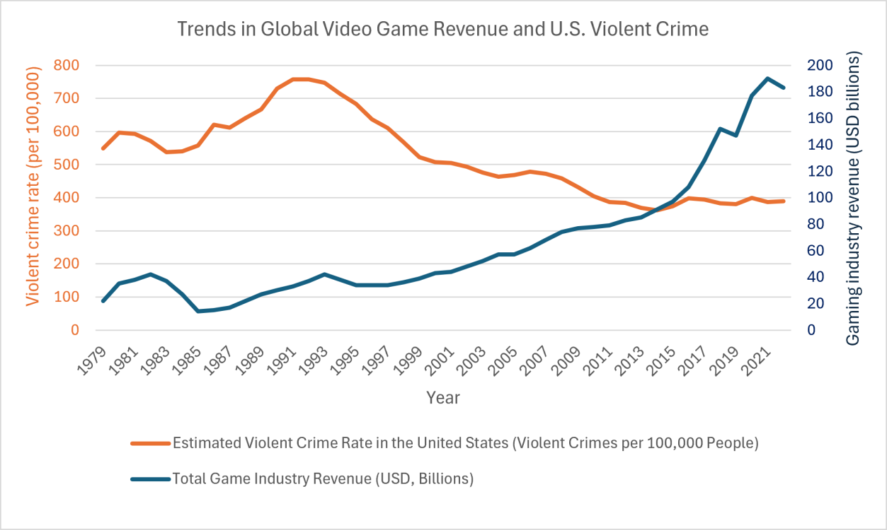

*The following essay was written for a school essay competition, so it may be a bit weird. The main audience is people who know extremely little about video games. Still decided to upload it though* `¯\_(ツ)_/¯`

Throughout history, the newest forms of entertainment have been repeatedly blamed for corrupting our youth. Books, comic books, music, television, table-top games and most recently, video games have been under fire for containing content alleged to encourage the youngest generation to commit immoral and violent acts. With the present subject of this scrutiny being video games, it would seem appropriate to ask whether video games cause violence. However, several assumptions are usually made when discussing this topic, such as believing video games always containing violent content, using violence and aggression as interchangeable terms, and that complex psychological issues can be explained by one form of entertainment. This essay argues that while violent video games can contribute to heightened short-term aggression, there is minimal evidence they directly lead to acts of real-life violence, and that the question being asked oversimplifies the causes of violent behaviour.

The violence in video games debate has persisted longer than many others due to the medium’s interactive nature. When playing video games, players take a more active role than readers and viewers who are merely observers, and they are often rewarded for overcoming opponents through in-game combat. Additionally, some video games such as those in the Mortal Kombat and Doom series have come under fire due to their often extravagant depictions of violence and gore, which have become increasingly realistic over time. Concerns are raised by parents who see their children play violent video games, and the scrutiny is further fuelled by politicians and news coverage. A modern example of this occurred in 2019, when, following several highly publicised school shootings, the President of the U.S. suggested in an NBC News interview that violent video games were contributing to youth violence. While these concerns are understandable, given the active role players take in violent video games, the crucial issue is whether the available evidence supports this claim.

At first glance, scientific evidence seems to support this claim. Numerous studies have reported a link between violent video games and aggression. However, the term “aggression” is often mistakenly used interchangeably with violence. In this context, aggression refers to thoughts or behaviour intended to harm another person, while violence refers to acts of serious physical harm. Aggressive behaviour is measured by doing tests such as the Competitive Reaction Time Test, in which subjects compete against another person, and then choose the duration and volume of a loud noise blast played to their opponent. Louder and longer blasts are interpreted as more aggressive behaviour. Most tests do not look for links between playing violent video games and committing actions such as assault and violent crime. Overall, results from these tests are mixed and there is much disagreement between scholars, as effects on aggression are small and hard to replicate. Additionally, evidence of increased short-term aggression is not evidence that video games lead to violent crime. This distinction has been recognised by organisations such as the American Psychological Association which has concluded that there is insufficient scientific evidence to support a causal link between violent video games and violent behaviour.

Beyond lab studies, real world trends can also be used to assess whether video games contribute to violent behaviour. Over the past few decades, the video game industry has grown to be the largest entertainment industry, generating more revenue than music and film industries. Gaming has become so large, in fact, that approximately 212 million Americans play video games at least once a week, roughly two thirds of the U.S. population. If violent video games were a cause of violent crime, then we would expect with their increasing popularity there would also be a rise in crime.

<figure>
  
</figure>

*Figure 1. Global video game industry revenue (USD billions) and the estimated U.S. violent crime rate per 100,000 people between 1979 and 2022.*

(Although Figure 1 compares global game industry data with U.S. crime data, the trends still provide useful information about how crime changed as the gaming industry grew.) Figure 1 shows that violent crime in the U.S. decreased between the early 90s and early 2010s, while the video game industry steadily increases in this same period. Even in the late 2010s and early 2020s when the video game industry grew the most, crime remained relatively constant. In the 80s, however, we can see the scale of the gaming industry and crime increase and decrease at similar times, while after the 90s they follow opposite trends. The relationship between both metrics being inconsistent over time suggests that there is not a simple cause-and-effect connection between the two. School shootings are often mentioned in discussions around violent video games. However, analyses of school shooters suggest that only around 20% of perpetrators showed a particular interest in violent video games, a value lower than that observed in the general population. These trends provide little support to the idea that video games are a major contributor to violent behaviour, and implies that the causes of violence are more complex than one piece of entertainment.

The constant fixation on video games in this debate raises an important question: why are other forms of media not criticised in the same way? Video games are usually judged more

harshly than other pieces of media with comparable levels of violent behaviour. For example, the Call of Duty franchise shows realistic depictions of modern warfare in a similar way to movies like Saving Private Ryan, and the Grand Theft Auto series portrays organised crime and violence in a similar way to The Sopranos or Breaking Bad. The Last of Us is a violent video game whose show adaptation recreates many of the game’s scenes, including their graphic violence, yet the show attracted considerably less controversy than the game itself. While violent content has been scrutinised in video games most recently, other pieces of media have been the focus of criticism in the past before becoming more generally accepted. This is often referred to as the moral panic, and video games are just the latest in a long line of forms of entertainment that have come under fire. Comic books were blamed for juvenile delinquency, rock music was accused of being satanic, Dungeons and Dragons was linked to suicide, and television was alleged to cause violence in a similar way to how video games are talked about today. Ironically, studies on violence on TV ended up with a similar conclusion as studies on video games, including evidence of short-term increases in aggression and possible desensitisation to violence.

Research into the causation of violent behaviour has come to one major conclusion: violence is multi-causal. This means that no single factor is responsible for violent behaviour. Instead, violence results from a combination of factors. Some of the risk factors which have been found to possibly lead to violent behaviour include having grown up in a violent environment, such as having been a victim of domestic abuse, having personality characteristics such as lack of empathy, and social factors such as peer pressure or being isolated. Violence is a complex issue, which cannot be explained by one form of media.

Much of the worry about violence in media is that players, particularly young children, will see violent acts and recreate them in real life. It is for this reason that video game age ratings exist, outlining a game’s content and the age it is recommended for. Video games such as Grand Theft Auto 5 are rated 18+, as they are intended to be played exclusively by adults, while video games with broader audiences get lower age ratings, such as Minecraft which is rated 7+. Violent video games are often blamed for causing children to be violent, even though they are specifically rated as not suitable for children. This suggests that the issue is not simply in the content of these games, but on whether parents and retailers will follow age ratings. This is a problem for age ratings, as in many countries age ratings are recommendations and not legal barriers,

So, do video games cause violence? While they can contribute to heightened short-term aggression, there is little evidence to suggest that they make people more likely to commit acts of violence. The distinction between aggression and violence is pivotal and often ignored in this discussion. Neither laboratory data nor real-world crime trends provide convincing evidence of a causal relationship between video games and violent behaviour. Furthermore, concerns about the effect on children are addressed by age ratings, which are put in place to safeguard them from being exposed to content intended for mature audiences. The continued focus on video games mirrors the scrutiny previously directed at other forms of entertainment during past cycles of moral panic. Ultimately, the question itself oversimplifies violence by attempting to attribute a complex, multi-causal problem to a single form of entertainment. 
